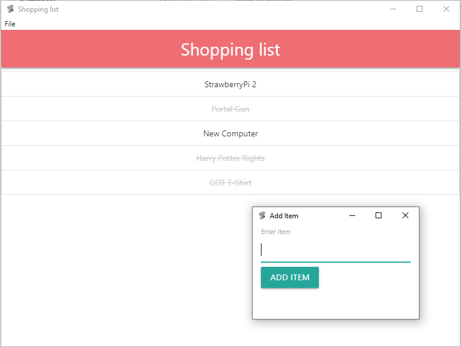

# Electron Shopping List
A simple shopping list built with Electron, following a [tutorial](https://www.youtube.com/watch?v=kN1Czs0m1SU) from [Brad Traversy](https://github.com/bradtraversy)

<p align='center'>
  
</p>

## Usage
### Installation
Installing dependencies
```
$ npm install
```

### Serve
Run the app
```
$ npm start
```

### Package & Build
For Windows
```
$ npm run package-win
```

For Linux
```
$ npm run package-linux
```

For Mac
```
$ npm run package-mac
```
